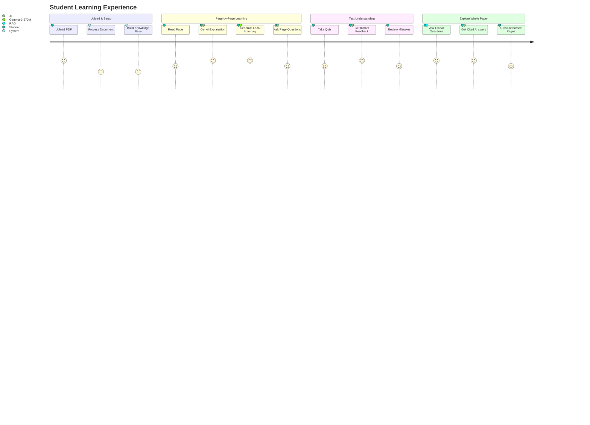
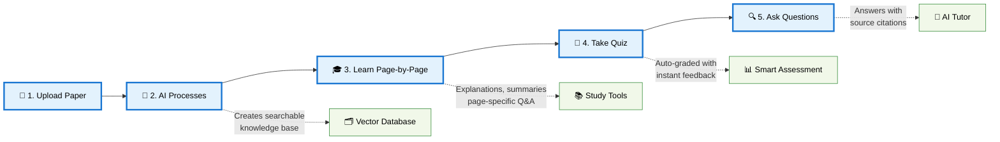
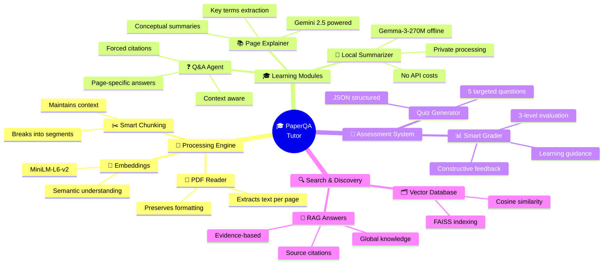
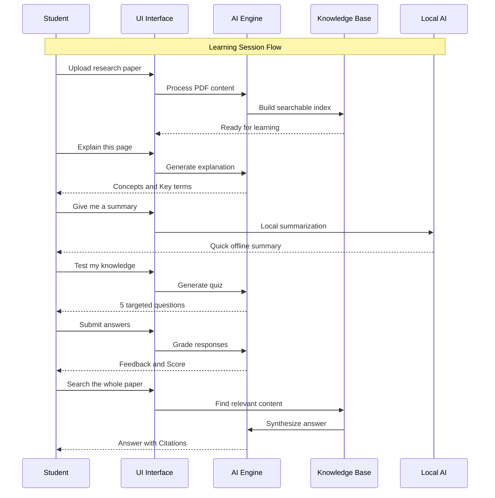
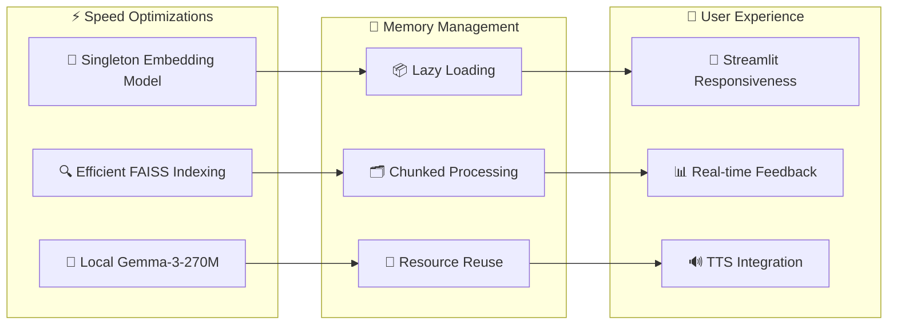

# 🏗️ Architecture — PaperQA Section Tutor

## 🎯 Overview

The **PaperQA Section Tutor** is an intelligent agent designed to help students comprehensively study research papers **page-by-page**. The system employs a multi-stage approach:

1. 📄 **PDF Ingestion** → 2. 🔍 **RAG Index** → 3. 📚 **Page Explanation** → 4. ❓ **Page Q&A** → 5. 🧪 **Quiz & Grading**

Plus an **🤖 offline local summarizer** fine-tuned on Gemma-3-270M for enhanced learning experience.

---

## 🧩 System Components

| Component | 🎯 Role | 🛠️ Key Libraries/Models |
|-----------|---------|------------------------|
| `agent/ingestor.py` | Extract page text with layout-preserving newlines | PyMuPDF (`fitz`) |
| `agent/embeddings.py` | Singleton embedding model loader | `sentence-transformers/all-MiniLM-L6-v2` |
| `agent/indexer.py` | Word-chunker + FAISS IP index (cosine) over all page chunks | FAISS |
| `agent/page_qa.py` | Per-page QA with small FAISS + Gemini synthesis + forced citations | FAISS, Google Generative AI |
| `agent/explainer.py` | Page explainer (Conceptual Summary / Breakdown / Key Terms) | Google Generative AI |
| `agent/qg_generator.py` | Quiz generation (exact 5 Q/A JSON) | Google Generative AI |
| `agent/evaluator.py` | Quiz grading (Correct / Partial / Incorrect + feedback) | Google Generative AI |
| `agent/summarizer.py` | **🌟 Local summarization (fine-tuned Gemma-3-270M)** | Transformers (AutoModelForCausalLM) |
| `agent/logger.py` | JSONL logging helper | Python stdlib |
| `ui/app.py` | Streamlit UI (PDF viewer, Page Tutor, RAG tab) | Streamlit |

### 🌐 External Dependencies
- **🧠 External Services:** Google Gemini (2.5 Flash Lite) for explanation, QG, grading, and RAG synthesis
- **🤖 Local Models:** MiniLM embeddings + Gemma-3-270M (merged LoRA) for local page summarization

---

## 🏗️ System Architecture Overview

```mermaid
flowchart TD
    %% User Input
    USER[👤 Student] 
    PDF[📄 Research Paper PDF]
    
    %% Core Processing Pipeline
    UPLOAD[📤 Upload PDF]
    INGEST[🔧 PDF Processing<br/>Extract text per page]
    CHUNK[✂️ Text Chunking<br/>Split into segments]
    EMBED[🧠 Create Embeddings<br/>MiniLM-L6-v2]
    INDEX[🗂️ FAISS Vector Store<br/>Searchable Knowledge Base]
    
    %% Two Main Learning Paths
    TUTOR[🎓 PAGE TUTOR<br/>Focused Learning]
    RAG[🔍 RAG SYSTEM<br/>Global Q&A]
    
    %% Page Tutor Features
    EXPLAIN[📚 Page Explanation<br/>Concepts & Terms]
    SUMMARY[🤖 Local Summary<br/>Gemma-3-270M Offline]
    PAGEQA[❓ Page Questions<br/>Specific to current page]
    QUIZ[🧪 Generate Quiz<br/>5 Questions]
    GRADE[📊 Auto-Grading<br/>Correct/Partial/Wrong]
    
    %% RAG Features
    SEARCH[🔎 Semantic Search<br/>Find relevant chunks]
    ANSWER[💬 AI Answer<br/>With source citations]
    
    %% Connections - Input Flow
    USER --> PDF
    PDF --> UPLOAD
    UPLOAD --> INGEST
    INGEST --> CHUNK
    CHUNK --> EMBED
    EMBED --> INDEX
    
    %% Main System Split
    INDEX --> TUTOR
    INDEX --> RAG
    
    %% Page Tutor Flow
    TUTOR --> EXPLAIN
    TUTOR --> SUMMARY
    TUTOR --> PAGEQA
    TUTOR --> QUIZ
    QUIZ --> GRADE
    
    %% RAG Flow
    RAG --> SEARCH
    SEARCH --> ANSWER
    
    %% User Interaction
    USER -.-> TUTOR
    USER -.-> RAG
    GRADE -.-> USER
    ANSWER -.-> USER
    
    %% Styling for clarity
    classDef userClass fill:#e3f2fd,stroke:#1976d2,stroke-width:3px
    classDef processClass fill:#f1f8e9,stroke:#388e3c,stroke-width:2px
    classDef tutorClass fill:#fce4ec,stroke:#c2185b,stroke-width:2px
    classDef ragClass fill:#e8f5e8,stroke:#2e7d32,stroke-width:2px
    classDef aiClass fill:#fff8e1,stroke:#f57c00,stroke-width:2px
    
    class USER,PDF userClass
    class UPLOAD,INGEST,CHUNK,EMBED,INDEX processClass
    class TUTOR,EXPLAIN,PAGEQA,QUIZ,GRADE tutorClass
    class RAG,SEARCH,ANSWER ragClass
    class SUMMARY aiClass
```

## 🔄 User Journey: How Students Learn with PaperQA

## 🎯 Simple Process Flow

## 🧠 AI Components Working Together

## 💻 Technical Implementation Details

### 🔄 System Interaction Patterns

---

## 🔧 Technical Design Choices

### 🎯 Core Principles

| **Principle** | **Implementation** | **Benefit** |
|---------------|-------------------|-------------|
| **🔄 Singleton Embeddings** | `@lru_cache` for sentence-transformer loading | Memory efficiency, faster response times |
| **📐 Cosine via IP Normalized** | L2-normalized vectors + FAISS `IndexFlatIP` | Accurate similarity without cosine overhead |
| **📌 Forced Citations** | Automatic citation appending if Gemini omits | Consistent UI experience and source tracking |
| **🤖 Local Summarizer** | Gemma-3-270M (LoRA merged) direct calls | Zero API latency, cost-free offline operation |
| **🏗️ Separation of Concerns** | UI orchestrates, agents handle specific tasks | Maintainable, testable, scalable architecture |

### 🚀 Performance Optimizations

---

## 📈 System Capabilities Matrix

| Feature Category | Capability | Technology Stack |
|-----------------|------------|------------------|
| **📄 Document Processing** | Multi-format PDF ingestion | PyMuPDF |
| **🔍 Information Retrieval** | Semantic search with citations | FAISS + MiniLM-L6-v2 |
| **🧠 AI Understanding** | Context-aware explanations | Gemini 2.5 Flash Lite |
| **🤖 Local Processing** | Offline summarization | Fine-tuned Gemma-3-270M |
| **🎓 Learning Assessment** | Intelligent quiz grading | Custom evaluation algorithms |
| **🔊 Accessibility** | Text-to-speech support | Browser TTS APIs |
| **📊 Progress Tracking** | Learning analytics | JSONL logging system |

---

## 🎭 Author

**👨‍🎓 Somya Jangir** • B23CI1036  
**🏛️ Civil & Infrastructure Engineering**  
**🏫 Indian Institute of Technology, Jodhpur**
