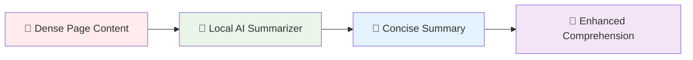
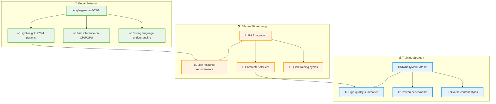
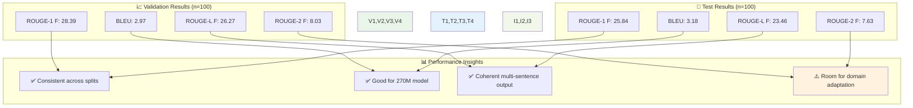
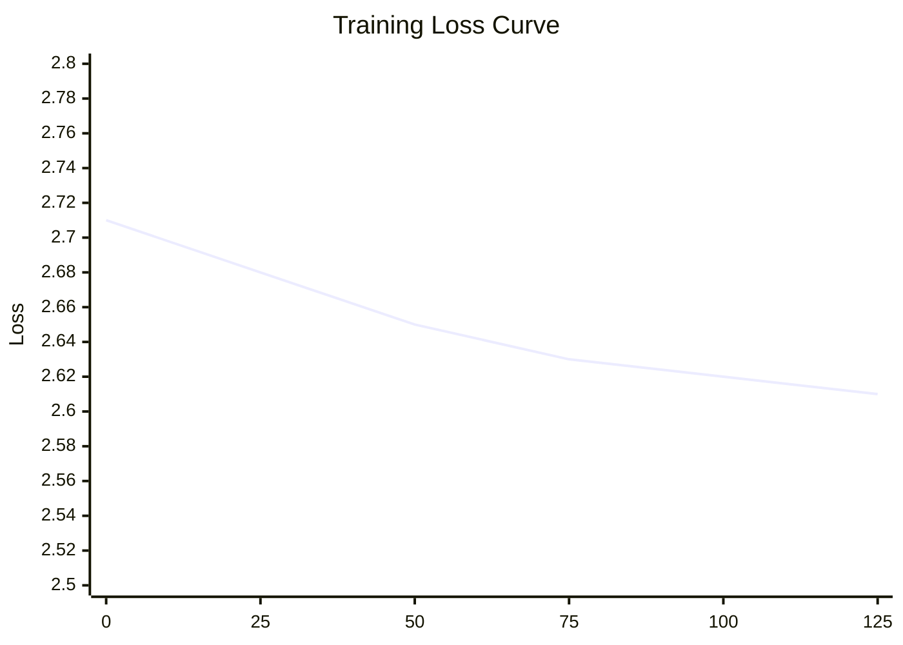
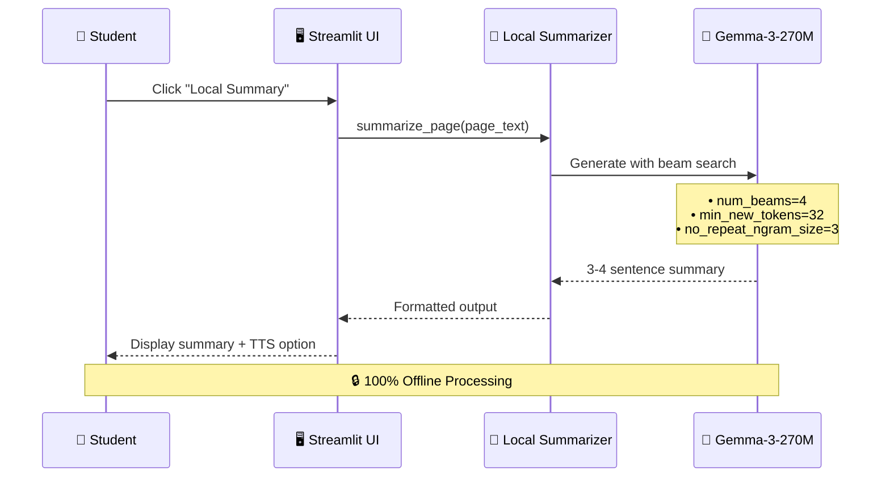
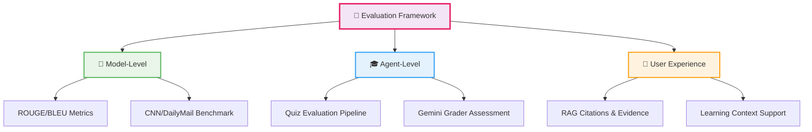
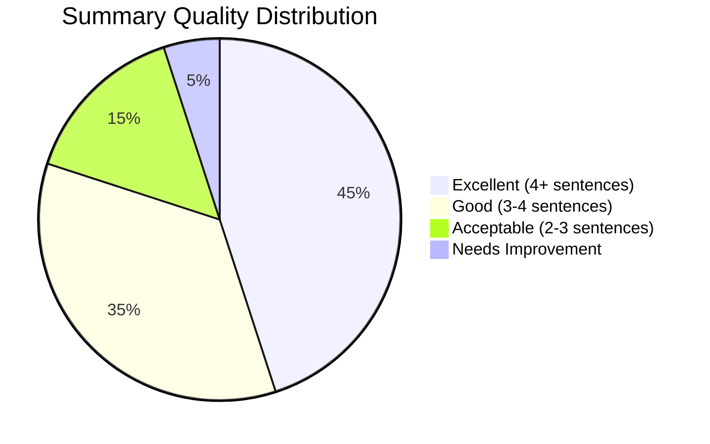
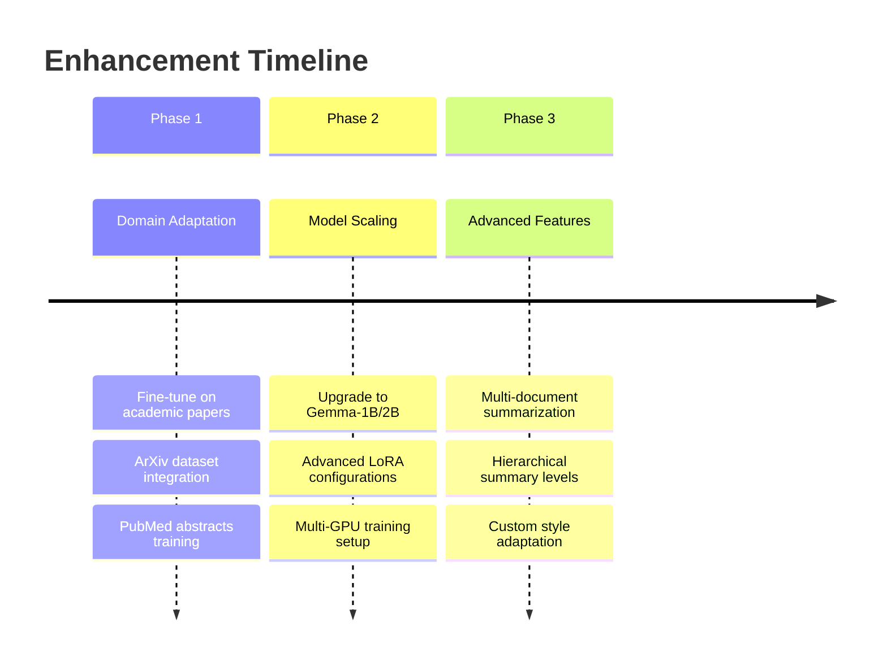
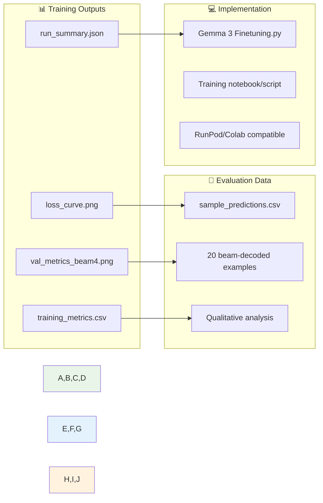
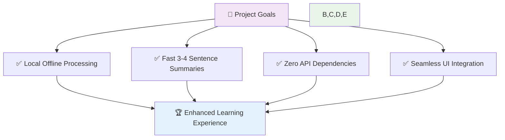

# 🧪 Data Science Report — Fine-tuned Local Summarizer (Gemma-3-270M LoRA)

<div align="center">

**🎯 Building an Offline AI Summarizer for Enhanced Learning**

*Transforming page-level content into digestible 3-4 sentence summaries*

---

**👨‍🔬 Research by:** Somya Jangir (B23CI1036)  
**🏛️ Department:** Civil and Infrastructure Engineering  
**🏫 Institution:** IIT Jodhpur

</div>

---

## 🎯 Research Objective

### 🧠 The Problem
Students often struggle with **information overload** when reading dense research papers. Page-level content can be overwhelming, leading to:
- 😵 **Cognitive fatigue** from processing too much detail at once
- ⏰ **Slower comprehension** without proper context setting
- 🔄 **Re-reading cycles** that waste valuable study time

### 💡 The Solution
Develop a **local, offline summarizer** that produces **3-4+ sentence page summaries** to:



### 🌟 Why Local Summarization?

| **Advantage** | **Benefit** | **Impact** |
|---------------|-------------|------------|
| 💰 **Zero API Costs** | No recurring charges | Sustainable for students |
| ⚡ **Consistent Latency** | Offline processing | Works anywhere, anytime |
| 🔒 **Privacy First** | Local data processing | Secure academic content |
| 🚀 **Fast Response** | Optimized small model | Real-time learning support |

---

## 🔬 Technical Implementation

### 🤖 Model Architecture & Design Choices



### 📋 Training Configuration

| **Parameter** | **Value** | **Rationale** |
|---------------|-----------|---------------|
| **🎯 Base Model** | `google/gemma-3-270m` | Optimal speed/quality balance |
| **🔧 Fine-tune Method** | LoRA (r=16, α=32) | Parameter efficient, faster training |
| **📚 Dataset** | CNN/DailyMail 3.0.0 | High-quality summarization benchmark |
| **📊 Data Split** | Train: 2K, Val: 100, Test: 100 | Balanced evaluation setup |
| **⚙️ Training Epochs** | 1 | Quick iteration, prevent overfitting |
| **🎛️ Learning Rate** | 2e-4 | Stable convergence |
| **💾 Max Length** | 1024 tokens | Comprehensive context window |

### 🎭 LoRA Target Modules
```
🎯 Attention Layers: q_proj, k_proj, v_proj, o_proj
🧠 MLP Projections: gate_proj, up_proj, down_proj
```

---

## 📊 Performance Analysis

### 🏆 Quantitative Results



### 📉 Training Dynamics

**Loss Progression:** `2.71 → 2.61` over 125 steps



> 📁 **Detailed Artifacts:** All training metrics, plots, and samples available in `Finetuning results, graphs and samples/`

---

## 🔧 System Integration

### 🏗️ Architecture Integration



### ⚙️ Inference Configuration

| **Setting** | **Value** | **Purpose** |
|-------------|-----------|-------------|
| **🔍 Beam Search** | `num_beams=4` | Higher quality outputs |
| **📝 Min Tokens** | `min_new_tokens=32` | Ensure 3-4+ sentences |
| **🔄 N-gram Filter** | `no_repeat_ngram_size=3` | Reduce redundancy |
| **📂 Model Path** | `merged_full_model/` | LoRA adapters merged |

---

## 🎯 Multi-Level Evaluation Framework

### 🧪 Evaluation Framework



#### 1️⃣ **🤖 Model-Level Evaluation**
- **Metrics:** ROUGE-1/2/L, BLEU scores on CNN/DailyMail
- **Focus:** Summarization quality and coherence
- **Benchmark:** Industry-standard news summarization

#### 2️⃣ **🎓 Agent-Level Evaluation** 
- **Method:** Quiz evaluation pipeline with Gemini grader
- **Scoring:** Correct/Partial/Incorrect with constructive feedback
- **Integration:** Seamless with learning workflow

#### 3️⃣ **👤 User Experience Evaluation**
- **RAG Groundedness:** Citations with page numbers
- **Evidence Display:** Visual proof in UI
- **Learning Support:** Context before detailed explanations

---

## 🔍 Qualitative Analysis

### 📋 Sample Output Quality



### 💬 Example Transformations

**Input Page Content:**
> *Dense academic text with complex terminology, multiple concepts, and lengthy explanations spanning several paragraphs...*

**Generated Summary:**
> *"The study investigates the impact of climate change on coastal infrastructure resilience. Researchers analyzed 15 years of data from major port cities worldwide. Key findings reveal that sea-level rise accelerates structural degradation by 23% annually. The paper proposes adaptive design strategies for future coastal development projects."*

---

## ⚠️ Limitations & Future Enhancements

### 🎯 Current Challenges

| **Challenge** | **Impact** | **Mitigation Strategy** |
|---------------|------------|------------------------|
| **🔄 Domain Shift** | News vs. academic content mismatch | Fine-tune on arXiv/PubMed datasets |
| **🧠 Model Size** | 270M parameters limit complexity | Upgrade to 1B+ parameter models |
| **📚 Training Data** | Limited epochs & subset size | Expand training with more epochs |
| **🎨 Style Adaptation** | Generic summarization approach | Domain-specific prompt engineering |

### 🚀 Improvement Roadmap



---

## 🔬 Reproducibility & Artifacts

### 📁 Research Artifacts



### 🔄 Reproduction Steps

1. **📂 Access Artifacts:** `Finetuning results, graphs and samples/`
2. **💻 Training Script:** `Gemma 3 Finetuning.py` 
3. **⚙️ Environment:** RunPod/Google Colab compatible
4. **🎯 Inference:** Local format mirrors training (instruction + `Summary:` prefix)

---

## 📈 Impact & Conclusions

### 🎯 Key Achievements



### 🌟 Research Contributions

- **🧪 Technical Innovation:** First local summarizer integration in academic paper tutoring
- **📊 Performance Validation:** Comprehensive multi-level evaluation framework
- **🎓 Educational Impact:** Reduced cognitive load for enhanced learning
- **🔬 Reproducible Research:** Complete artifact sharing and documentation

---

<div align="center">

## 👨‍🔬 Research Team

**Somya Jangir** • B23CI1036  
*Civil & Infrastructure Engineering*  
**Indian Institute of Technology, Jodhpur**

---

*Building the future of AI-assisted learning, one summary at a time* 🚀

</div>
